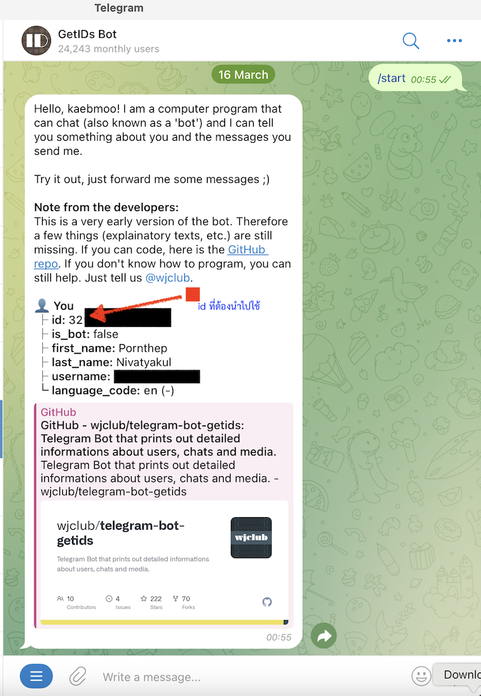

---

**Temperature Measurement and Electrical Device Control User Manual**

---

### Device Installation

If the Wi-Fi has not been configured, the device will not be able to connect to the internet. It will automatically enter Wi-Fi setup mode and create an Access Point named **ogosense**.  
Use your phone or computer to connect to the **ogosense** Wi-Fi network (password: **12345678**) to access the setup page.  
Once connected, a configuration screen will appear. Select a Wi-Fi network with internet access, such as your home or office network and save configuration.

---

After connecting, a configuration page will appear. From there, select the Wi-Fi network that has internet access (e.g., your home or office network).

---

### Viewing Status or Setting the Temperature

You can chat with the device via the **Telegram app**.

- For iPhone, download the app here: [https://apps.apple.com/us/app/telegram-messenger/id686449807](https://apps.apple.com/us/app/telegram-messenger/id686449807)
- For Android, download it here: [https://play.google.com/store/apps/details?id=org.telegram.messenger&hl=en](https://play.google.com/store/apps/details?id=org.telegram.messenger&hl=en)

Once the app is installed and you’ve completed the registration, add the bot **@getidsbot** to retrieve your Telegram user ID.  
Send the command `/start` to the bot, and you will receive your user ID.  
This ID must then be added to the **Telegram MQTT Bridge (ESP32)** system, which authorizes you to access the device. This allows the Telegram bot to communicate with the ESP32, which in turn sends messages to the **MQTT Server (EMQX)**. The server then relays commands to the **ESP8266**, and the ESP8266 sends data back via the MQTT server to the ESP32, which replies to the Telegram chatbot.

The system supports a **maximum of 5 Telegram user IDs**. Two IDs are hardcoded into the board, which means you can add **up to 3 additional users** who will be able to monitor or control the device.



---

### Checking Temperature or Device Status

To interact with the device, add the Telegram bot (created using [@BotFather](https://t.me/BotFather)) by its name (e.g., **@xxxxx**).

Once added, use the `/start` command to check whether the bot can communicate with the device, or type `/help` to see the list of available commands.

> **Note:** The bot's token must also be correctly set in the ESP32 or Telegram MQTT Bridge software.

#### Example command:

To check the temperature or status of a device, use the command:

```
/status <device id>
```

Where `<device id>` is the ID assigned to a specific ESP8266 device.

For example:

```
/status 12345
```

(`12345` is the device ID)

Example screenshots:

  


---
